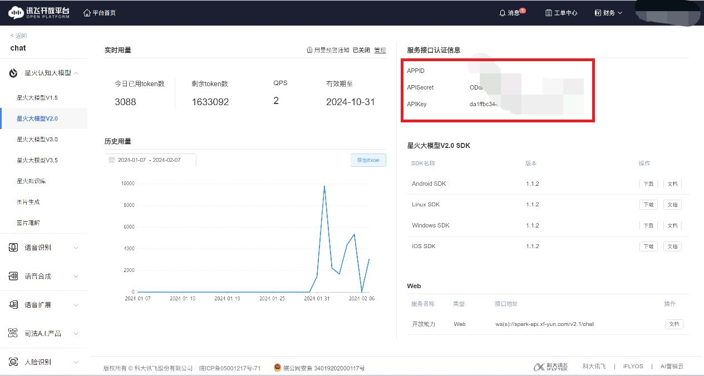

<h1 align="center">Web Wechat Bot</h1>

「Web Wechat Bot」是一个基于Wechaty、可通过网页远程登录管理、可接入讯飞星火、ChatGPT、通义千问等大语言模型的微信聊天机器人，使用微信网页版协议。你可以通过网页登录微信、设置回复规则、配置API接口等。


## 🖥主要技术构成

**前端主要技术栈**

- Vue3
- Vue-router
- ElementPlus

**后端主要技术栈**

- Node.js

- Express

- Wechaty

- SQLite3

- websocket

  

## 💡项目文件结构

```
WebWechatBot                            
├─ API                                  
│  ├─ ChatGPT.js                        
│  ├─ tongyi.js                         
│  └─ xunfei.js                         
├─ db                                   
│  └─ data.db                           
├─ public                               
│  ├─ css                                 
│  ├─ js                                              
│  └─ index.html                        
├─ wechat                               
│  ├─ avatar                                              
│  └─ main.js                           
├─ app.js                               
├─ config.js                            
├─ LICENSE                              
├─ package.json                         
├─ README.md                            
└─ router.js                            
```


## 💽Setup

本项目可在 Linux、MacOS、Windows 系统上运行（在Linux服务器上可实现长期运行、远程控制管理)

此仓库包含已经编译好的前端页面，可不做更改直接使用。如果你想对前端页面进行更改，请前往：[https://github.com/Pchen0/Web-Wechat-Bot-Dashboard](https://github.com/Pchen0/Web-Wechat-Bot-Dashboard)。

#### 0.安装Node.js

Wechaty要求Node.js版本高于10，如果你还没有安装Node.js 或者你的版本低于10, 请参考下面的链接安装最新版本的Node.js:

[Node.js](https://nodejs.org/en/download/package-manager/)

#### 1.克隆远程库

```
git clone https://github.com/Pchen0/Web-Wechat-Bot.git
```

#### 2.安装依赖

首先进入项目目录

```
cd Web-Wechat-Bot
```

安装依赖

```
npm install
```

#### 3.运行服务器

```
node app.js
```

运行之前可在config.js文件中修改项目运行的端口，记得在防火墙或安全组放行端口

```js
module.exports = {
    port: 8080	//默认在8080端口上运行
}
```

#### 4.配置

通过你的ip地址+端口号进入到机器人的管理界面，默认用户名为`admin`，密码`123456`。

你可在后文的配置填写一节中查看关于配置填写的详细介绍。


## 📦配置填写

在API设置页面中填入你的接口地址、API Key、模型名称等，你可以自由选择讯飞星火、ChatGPT、通义千问等模型。


### API接口设置填写说明

#### 讯飞星火

**官方文档：**[https://www.xfyun.cn/doc/spark/Web.html](https://www.xfyun.cn/doc/spark/Web.html)

**API接口地址：**

3.5版本：ws://spark-api.xf-yun.com/v3.5/chat，

3.0版本：ws://spark-api.xf-yun.com/v3.1/chat，

2.0版本：ws://spark-api.xf-yun.com/v2.1/chat，

1.5版本：ws://spark-api.xf-yun.com/v1.1/chat，

讯飞助手的接口地址在助手创作中心获取。

**APIKEY、APISecret、APPID：**在讯飞开放平台创建应用后即可获取，注意不要混淆APIKEY和APISecret。



**模型版本：**选择你所使用的模型版本，请与API接口地址对应的版本一致。

general指向V1.5版本;
generalv2指向V2版本;
generalv3指向V3版本;
generalv3.5指向V3.5版本。

**最大token数：**模型回答的tokens的最大长度。V1.5取值为[1,4096]
V2.0、V3.0和V3.5取值为[1,8192]，默认为2048。

**温度：**核采样阈值。用于决定结果随机性，取值越高随机性越强即相同的问题得到的不同答案的可能性越高。取值范围 (0，1] ，默认值0.5。


#### ChatGPT

**注：**兼容openai接口的API可填入ChatGPT的配置中。

**官方文档：**[https://platform.openai.com/docs/](https://platform.openai.com/docs/)

**APIKey：**在控制台获取。你的APIKey格式应该为：sk-xxxxxxxxxxxxxxxxxxxx。

**app_code：**该项专为一些兼容openai接口的平台设置，可忽略。

**模型名称：**填写你想使用的模型的名称，如gpt-3.5-turbo。

**预设内容：**填写你对机器人的设定和要求，填写越详细效果越好，但会增加token的使用量。


#### 通义千问

**API接口地址：**如https://dashscope.aliyuncs.com/api/v1/services/aigc/text-generation/generation

**APIKey：**请参考https://help.aliyun.com/zh/dashscope/developer-reference/activate-dashscope-and-create-an-api-key

**温度：**用于控制随机性和多样性的程度。取值范围：[0, 2)，系统默认值0.85。

**模型名称：**填写你所使用的模型名称，如qwen-turbo、qwen-max、qwen-max-longcontext等。

**最大token：**用于限制模型生成token的数量，max_tokens设置的是生成上限，并不表示一定会生成这么多的token数量。其中qwen-turbo 最大值和默认值为1500， qwen-max、qwen-max-1201 、qwen-max-longcontext 和 qwen-plus最大值和默认值均为2000。

**预设内容：**填写你对机器人的设定和要求，填写越详细效果越好，但会增加token的使用量。


### WechatBot设置填写说明

**选择模型：**选择你想使用的模型，支持讯飞星火、ChatGPT、通义千问。请预先在API接口设置页面填写好你的配置信息。

**自动回复前缀：**填写的文字会被加到机器人回复消息的最前面，可使用\n换行。能用于区分机器人和真人。群聊和私聊通用。

**自动回复后缀：**填写的文字会被加到机器人回复消息的最后面，可使用\n换行。能用于区分机器人和真人。群聊和私聊通用。

**是否开启私聊自动回复：**关闭后将不回复所有私聊消息。

**私聊黑名单：**填写好友的微信昵称（不是备注），多个名称用英文逗号（,）分隔，系统不会回复被填入黑名单的好友的消息。

**群聊关键字回复：**系统会自动回复含有关键词的群聊消息。多个关键词用英文逗号分隔。

**群聊白名单：**当群聊白名单不为空时，机器人只会回复在白名单中的群聊消息；当群聊白名单为空时，机器人会回复所有群聊的消息。

**是否在被@时回复：**开启后机器人会在自己被@后进行回复。


至此，本项目的搭建已接近尾声。进入微信登录页面，扫描二维码登录微信，登录成功后你的微信机器人就创建完成了。


同时，你也可以进入对话测试页面与大语言模型进行对话，此页面使用的模型、前缀、后缀等与WechatBot设置中的相同。
