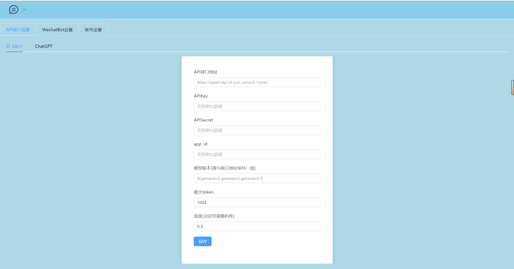
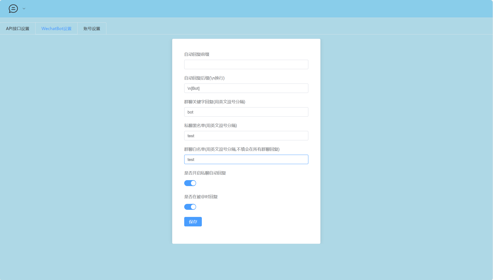
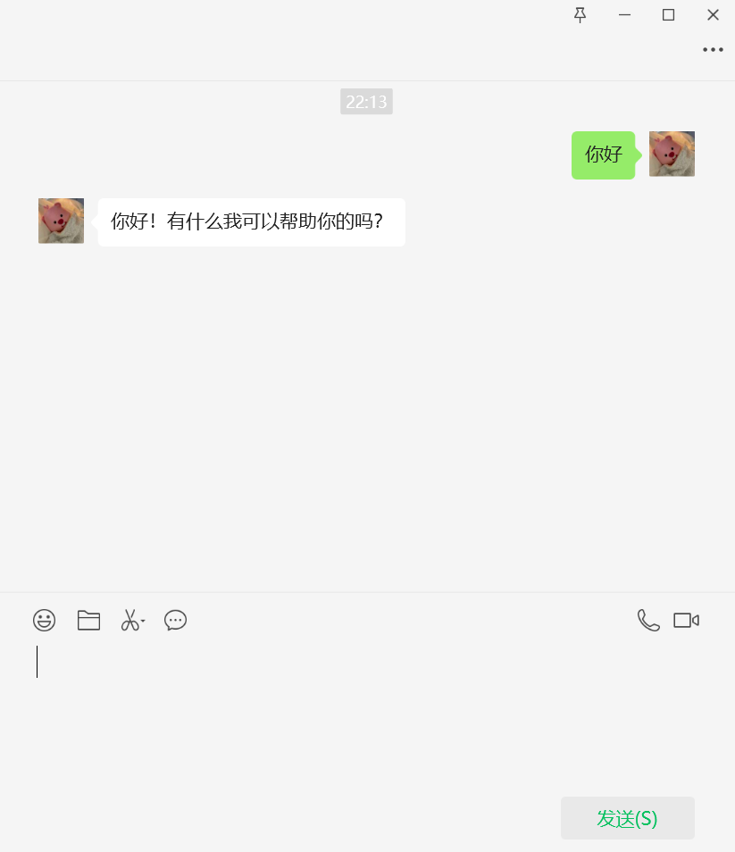

<h1 align="center">Web Wechat Bot</h1>

「Web Wechat Bot」是一个基于Wechaty、可通过网页远程登录管理、可接入讯飞星火、ChatGPT等大语言模型的微信聊天机器人，使用微信网页版协议。


## 🖥主要技术构成

**前端主要技术栈**

- Vue3
- Vue-router
- ElementPlus

**后端主要技术栈**

- Node.js

- Express

- Wechaty

- Sqlite3

  

## 💡项目文件结构

```
WebWechatBot                            
├─ API                                  
│  ├─ ChatGPT.js                        
│  └─ xunfei.js                         
├─ db                                   
│  └─ data.db                                                  ├─ public                               
│  ├─ css                                
│  ├─ js                                
│  └─ index.html                        
├─ wechat                               
│  ├─ avatar                                               
│  └─ main.js                           
├─ app.js                               
├─ config.js                            
├─ package.json                         
├─ README.md                            
└─ router.js                            
		
```


## 💽Setup

本项目可在 Linux、MacOS、Windows 系统上运行（在Linux服务器上可实现长期运行、远程控制管理)

#### 0.安装Node.js

Wechaty要求Node.js版本高于10，如果你还没有安装Node.js 或者你的版本低于10, 请参考下面的链接安装最新版本的Node.js:

[Node.js](https://nodejs.org/en/download/package-manager/)

#### 1.克隆远程库

```
git clone https://github.com/Pchen0/Web-Wechat-Bot.git
```

#### 2.安装依赖

首先进入项目目录

```
cd Web-Wechat-Bot
```

安装依赖

```
npm install
```

#### 3.运行服务器

```
node app.js
```

运行之前可在config.js文件中修改项目运行的端口，记得在防火墙或安全组放行端口

```js
module.exports = {
    port: 8080	//默认在8080端口上运行
}
```

#### 4.配置

通过你的ip地址+端口号进入到机器人的管理界面，默认用户名为`admin`，密码`123456`

在API设置页面中填入你的接口地址、API Key、模型名称等，你可以自由选择讯飞星火和ChatGPT两个模型，其中兼容openai接口的API可填入ChatGPT的配置中。



在Wechat Bot设置界面你可以选择使用的语言模型、设置机器人的一些回复规则。



至此，本项目的搭建已接近尾声。进入微信登录页面，扫描二维码登录微信，登录成功后你的微信机器人就创建完成了。



